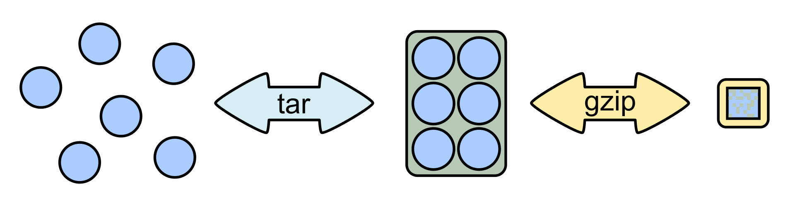
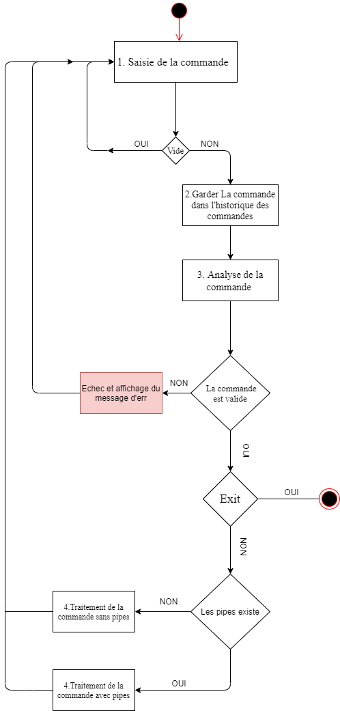
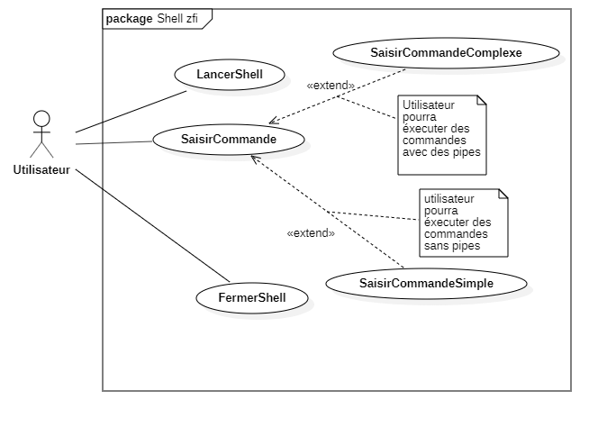
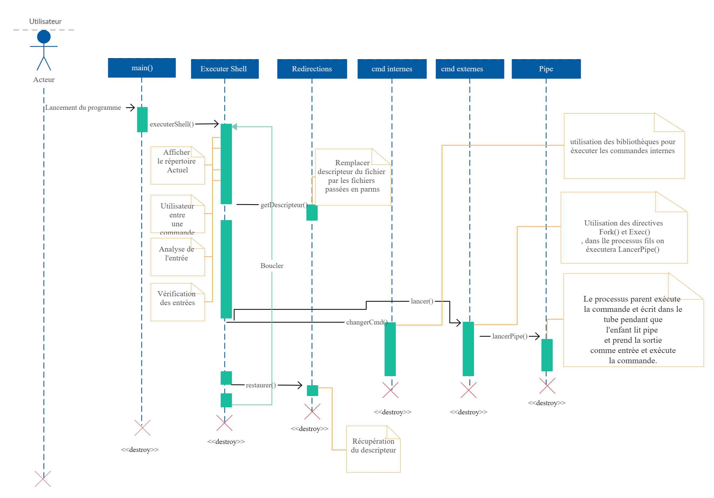

# Introduction 
### Sujet : un `Shell` pour les`tarballs` (*.tar) 
Le but du projet est de faire tourner un <ins>`Shell`</ins> qui permet à l'utilisateur de traiter les <ins>`tarballs`</ins> comme s'il s'agissait de répertoires, **sans que les tarballs ne soient désarchivés**.
Mais ca consiste en quoi un Shell ? et les tarballs ?

<ins>**Définitions :**</ins>  
<ins>**Shell :**</ins> Le Shell (ou interface système en français) est un programme qui reçoit des commandes informatiques données par un utilisateur à partir de son clavier pour les envoyer au système d’exploitation qui se chargera de les exécuter.  

<ins>**Tarballs :**</ins> Le programme tar (de l'anglais tape archiver, littéralement « archiveur pour bande ») est un logiciel d'archivage de fichiers standard des systèmes de type UNIX. Il a été créé dans les premières versions d'UNIX et standardisé par les normes POSIX.1-1988 puis POSIX.1-2001. Il existe plusieurs implémentations1 tar, la plus couramment utilisée étant GNU tar. (Wikipédia)

### Préambule : 
Pour aboutir à une architecture logicielle rigoureuse on va devoir définir profondément les caractéristiques de ces deux instances (Shell et Tarballs) . Ceci dit connaitre les caractéristiques de chacun des deux nous mène à une application robuste qui fonctionne dans les normes.

<ins>**Caractéristiques d'un Shell :**</ins>
Les interpréteurs de commandes ont les caractéristiques suivantes :
- Permettre à l'utilisateur de saisir des commandes .
-  Ils possèdent des commandes `internes` et `externes`
	- **Commandes internes :**   sont des commandes dont le code est implanté au sein de l’interpréteur de commande . Exemples de commandes internes : **cd** , **echo** , **for** , **pwd** .
	
	- **Commandes externes :** Une _commande externe_ est une commande dont le code se trouve dans un fichier ordinaire. Le Shell crée un processus pour exécuter une commande externe. Parmi l’ensemble des commandes externes que l’on peut trouver dans un système, nous utiliserons principalement les _commandes Unix_ (ex : **ls**, **mkdir**, **vi**, **sleep**) et les _fichiers Shell_.
- Programmation Shell  , un langage de programmation qui inclut des fonctionnalités telles que des boucles, des instructions de condition et des variables.
- Manipulation des signaux , Mécanismes pour manipuler  les interruptions et autres signaux envoyés par le système d'exploitation.
- Historique de commandes , Une fonctionnalité qui stocke les commandes et vous permet de les modifier et de les réutiliser.

<ins>**Caractéristiques d'un Tarball :**</ins>
- Permettre à l'utilisateur de créer des archives.
- Permettre à l'utilisateur de voir le contenu des archives.
- Permettre à l'utilisateur d'extraire des fichiers.

Par défaut, une archive tar n'est pas compressée, mais il suffit d'utiliser dessus un outil de compression tel que `gzip` pour obtenir des archives compressées `*.tar.gz` , souvent aussi nommées `*.tgz`  
  
**Le format des archives Tar :**
Un fichier `tar` est une suite de blocs de 512 octets. S'il représente une archive des fichiers `f1`, … , `fn`, alors ce fichier `tar` comporte, dans l'ordre :

-   un bloc entête pour `f1`
-   les blocs correspondant au contenu de `f1`
-   …
-   un bloc entête pour `fn`
-   les blocs correspondant au contenu de `fn`
-   deux blocs finaux formés uniquement de zéros

Si la taille d'un des fichiers archivés `fi` n'est pas un multiple de 512, alors le dernier bloc concernant `fi` est complété avec des octets nuls `'\0'` à hauteur de 512 octets.
Un bloc entête a une structure décrite par le type `struct posix_header` dans le fichier [tar.h](../tar.h)  .cette structure fait exactement 512 octets de long. (TP1 SY5 2020)
```c
struct posix_header
{                              /* byte offset */
 char name[100];               /*   0 */
 char mode[8];                 /* 100 */
 char uid[8];                  /* 108 */
 char gid[8];                  /* 116 */
 char size[12];                /* 124 */
 char mtime[12];               /* 136 */
 char chksum[8];               /* 148 */
 char typeflag;                /* 156 */
 char linkname[100];           /* 157 */
 char magic[6];                /* 257 */
 char version[2];              /* 263 */
 char uname[32];               /* 265 */
 char gname[32];               /* 297 */
 char devmajor[8];             /* 329 */
 char devminor[8];             /* 337 */
 char prefix[155];             /* 345 */
 char junk[12];                /* 500 */
};
```

# Architecture générale du Shell
## Expression de besoins , cas d'utilisations et analyse 
### Durée de vie d'un shell 
Un Shell fait trois choses principales au cours de sa vie :
1. **Initialisation :** dans cette étape, un Shell typique lit et exécute ses fichiers de configuration. Celles-ci modifient certains aspects du comportement du Shell.
2. **Interprétation :** Ensuite, le Shell lit les commandes de `stdin` (qui pourrait être interactif, ou un fichier) et les exécute.
3. **Terminaison :** Une fois ses commandes exécutées, le Shell exécute toutes les commandes d'arrêt, libère de la mémoire et s'arrête.
### Le processus de fonctionnement de notre Shell `zfi`
#### Une fois la commande entrée, les opérations suivantes sont effectuées:

1. La commende est entrée , si cette commande n'est pas la chaine vide on la garde dans l'historique des commandes .
2. Analyse : consiste en la division des commandes en sous chaines pour les interpréter .
3. Analyse pour les caractères spéciaux comme : **|** **<** **>** **2>** .
4. Vérification de l'existence de la commande dans le Shell i.e. une commende interprétable .
5. S'il existe des pipe , on les manipulera .
6. Exécution des  commandes en utilisant les processus avec la famille des **exec** **( execl , execv ...)** et **fork** .
7. Attendre la prochaine entrée .
## Diagramme du processus de fonctionnement 
  

## Outils techniques  pour l'implémentation 
+ La manipulation des fichiers se fera à l'aide des appels systèmes `open`, `close`, `read`, `write` 
+ La manipulation des répertoire se fera avec `opendir`, `readdir`, `closedir`  et `getcwd`, `chdir`, `mkdir` 
+ L'analyse peut être effectuée à l'aide de `strsep ("")` ,`strstr()` et quelques fonctions de manipulation de chaînes de caractères qui figurent dans `<string.h>`
+ Après l'analyse, on vérifie la liste des commandes intégrées et, le cas échéant, on l'exécute 
+ La détection des pipes peut également être effectuée à l'aide de `strsep («|»)` par exemple . 
+ pour plus de détails … (voir le code source)

## Expression de besoins 
### Spécifications fonctionnelles 
- Le système (Shell) doit permettre à l'utilisateur de manipuler les tarballs sans même les désarchiver.
- Le système doit permettre à l'utilisateur d'utiliser les commandes `cd` et `exit` avec leur comportement habituel 
- Le système doit permettre à l'utilisateur d'utiliser toutes les commandes externes et elles  doivent fonctionner normalement si leur déroulement n'implique pas l'utilisation d'un fichier (au sens large) dans un tarball.
- Le système doit permettre à l'utilisateur d'utiliser la commande `pwd` et celle-ci doit fonctionner y compris si le répertoire courant passe dans un tarball.
- Le système doit permettre à l'utilisateur d'utiliser `mkdir`, `rmdir` et `mv` et doivent fonctionner y compris avec des chemins impliquant des tarball quand ils sont utilisés sans option.
- Le système doit permettre à l'utilisateur d'utiliser `cp` et `rm` et doivent fonctionner y compris avec des chemins impliquant des tarball quand ils sont utilisés sans option ou avec l'option `-r`
- Le système doit permettre à l'utilisateur d'utiliser   `ls` et elle doit fonctionner y compris avec des chemins impliquant des tarball quand il est utilisé sans option ou avec l'option `-l`
- Le système doit permettre à l'utilisateur d'utiliser `cat` et elle doit fonctionner y compris avec des chemins impliquant des tarball quand il est utilisé sans option
- Le système doit permettre à l'utilisateur d'utiliser les redirections de l'entrée, de la sortie et de la sortie erreur
- Le système doit permettre à l'utilisateur d'introduire des commandes complexes (utilisation des pipes "|") 


| Id | Spécification | État | Criticisme | Stabilité | 
| -- | --------------   | ----  | -----------  | ------- | 
| 1 | Le système (Shell) doit permettre à l'utilisateur de manipuler les tarballs sans même les désarchiver | Incorporé | Critique | Stable | 
| 2 | Le système doit permettre à l'utilisateur d'utiliser les commandes `cd` et `exit` avec leur comportement habituel | Incorporé | Critique | Stable | 
| 3 |Le système doit permettre à l'utilisateur d'utiliser toutes les commandes externes et elles  doivent fonctionner normalement si leur déroulement n'implique pas l'utilisation d'un fichier (au sens large) dans un tarball | Incorporé | Critique | Stable | 
| 4 | Le système doit permettre à l'utilisateur d'utiliser la commande `pwd` et celle-ci doit fonctionner y compris si le répertoire courant passe dans un tarball | Incorporé | Critique | Stable | 
| 5 | Le système doit permettre à l'utilisateur d'utiliser `mkdir`, `rmdir` et `mv` et doivent fonctionner y compris avec des chemins impliquant des tarballs quand ils sont utilisés sans option  | Incorporé | Critique | Stable | 
| 6 | Le système doit permettre à l'utilisateur d'utiliser `cp` et `rm` et doivent fonctionner y compris avec des chemins impliquant des tarballs quand ils sont utilisés sans option ou avec l'option `-r` | Incorporé | Critique | Stable | 
| 7 | Le système doit permettre à l'utilisateur d'utiliser   `ls` et elle doit fonctionner y compris avec des chemins impliquant des tarballs quand il est utilisé sans option ou avec l'option `-l` | Incorporé | Critique | Stable | 
| 8 | Le système doit permettre à l'utilisateur d'utiliser `cat` et elle doit fonctionner y compris avec des chemins impliquant des tarballs quand il est utilisé sans option| Incorporé | Critique | Stable | 
| 9 | Le système doit permettre à l'utilisateur d'utiliser les redirections de l'entrée, de la sortie et de la sortie erreur | Approuvé | Critique | Stable | 
| 10 | Le système doit permettre à l'utilisateur d'introduire des commandes complexes (utilisation des pipes "\|") | Incorporé |  Critique | Stable |  

**État**  
`Proposé : en cours de discussion, pas encore validé`  
`Approuvé : validé et attend d’être implémenté`  
`Rejeté : rejeté et n’attendra pas son implémentation`  
`Incorporé : spécification qui a été implémentée durant une version antrieure`  
**Criticisme**  
`Critique : la spécification doit être implémentée sinon le système n’est pas accepté`  
`Important : la spécification peut être omise mais son omission affecterait considérablement l’utilisabilité du système`  
`Utile : la spécification peut être omise et son omission n’a pas un grand impact sur le système`   
**Stabilité**  
`La probabilité que la spécification change dans le temps`  
 Ces attributs évoluent au fil du temps ( avancement du projet )


### Spécifications techniques 
- Le système doit être programmer en langage C
- Le système doit lancer tous les processus en premier plan
- Le système doit être testé sur la distribution linux antiX-19 (v19.2.1) ou bien sur un conteneur Docker 
- le système doit être programmer en utilisant seulement les bibliothèques et les fonctions de bas niveau

## Cas d'utilisations 
Un diagramme de cas d'utilisation de ce Shell (simplifié au maximum)


## Récapitulatif 
Pour un récapitulatif consistant y'a pas mieux qu'un **_`diagramme de séquence`_** pour représenter tout ça 
  

## Structures de données et prototypes de fonctions
### Structures de données

1. la structure _`struct posix_header`_ fourni dans le _header_ `tar.h`  définie déjà auparavant .
```c
struct posix_header
{                              /* byte offset */
 char name[100];               /*   0 */
 char mode[8];                 /* 100 */
 char uid[8];                  /* 108 */
 char gid[8];                  /* 116 */
 char size[12];                /* 124 */
 char mtime[12];               /* 136 */
 char chksum[8];               /* 148 */
 char typeflag;                /* 156 */
 char linkname[100];           /* 157 */
 char magic[6];                /* 257 */
 char version[2];              /* 263 */
 char uname[32];               /* 265 */
 char gname[32];               /* 297 */
 char devmajor[8];             /* 329 */
 char devminor[8];             /* 337 */
 char prefix[155];             /* 345 */
 char junk[12];                /* 500 */
};
```
2. Tableau de chaines de caractères des commandes existantes dans le Shell
```c
...
#define NBCMD 10
...
char *listeDesCommande[NBCMD]={"cd","rm","pwd","mkdir","rmdir","exit","ls","cat","cp","mv"};
```
avec `NBCMD` nombre de commandes dans le Shell .
3. la structure `commande`qui définie une commande avec son nom , ses paramètres et ses options 
```c 
...
#define NBPARAMS 10
#define NBOPTIONS 10
...
struct Commande{
	char nomCommande[30];
	int nbParamsEffect;
	char parametresCommande[NBPARAMS];
	int nbOptionsEffect;
	char *optionsCommande[NBOPTIONS];
};
```
avec `NBPARAMS` et `NBOPTIONS` le nombre de paramètres et le nombre d'options , respectivement  , d'une commande donnée.  
4. La structure `command` qui définie une liste de chaînes , utilisée pour exécuter les commandes complexes   
```c
struct command {
   char **argv;
};
```  

5. Les trois variables globales `pwd_gloabl` , `in_tar` et `tar_actuel` qui permettent de manipuler _working directory_ (répértoire actuel de travaille) . Comme notre shell peut traverser les tarballs alors des variables pareils s’avèrent nécessaires pour orchestrer les déplacement dans le shell avec la commande cd et garder la trace de `pwd` _(i.e. wd)_
```c
...
char pwd_global[1024]="";
int in_tar=0; 
char tar_actuel[1024]="";
...
```
`pwd_global` : pour sauvegarder a tout moment le répertoire de travail actuel 
`in_tar` :   vaut 1 si on est dans un chemin qui inclue un tar , 0 sinon .
`tar_actuel` : variable qui porte le nom du tar actuel si `pwd_global` comporte un tar .  
_`NOTABENE:pour plus de détails voir le code ...`_  
Les fonctionnalités de la première partie sont exactement le squelette du Shell , cela veut dire les fonctions et procédures qui vont être utilisées pour exécuter par la suite  les commandes qui vont manipuler des fichier *.tar .
 # Partie II : 
 Comme la partie I était  le squelette du Shell . la partie II  réponde exactement à la partie spécification des besoins en implémentant les spécifications techniques et spécifications fonctionnelles .
 ## Structure et fichiers 
 la structure du projet est la suivante :  
 + Le projet comporte essentiellement les fichiers suivants , `main.c` qui est le programme principale duquel on lance le Shell (zfi) ,`our_shell_zfi.c` un fichier source `.c` qui contient les différentes fonctions du projet (le corps des fonctions) , `our_shell_zfi.h` un fichier source `.h` (fichier entête ou _header file_)   qui comporte les prototypes (ou signatures)  des fonctions , les variables globales , les définitions `#define` et les inclusions `#include`   
 + Des fichiers en Markdown , `AUTHORS.md` ,`README.md` et ce fichier `ARCHITECTURE.md` qui décrivent respectivement , les auteurs du projets , description du projet et l'architecture du projet   
 + Des répertoires utilitaires pour l'avancement du projet et la représentation de l'architecture  , `Images` , `Drafts` et `Collab`  
 + Un fichier `tests.c` pour les testes unitaires de fonctions  
 + Un `Dockerfile` pour construire l'image sur laquelle marche le Shell  
### Détails et explication du contenu des fichiers  
commençant par le programme principale , i.e `main.c` qui comporte trois parties 
+ La première partie est la partie de déclaration et initialisation des variables pour la gestion des arguments et des redirections ainsi que la capture des signaux (pour quelques commandes)
+ La deuxième partie c'est un appel à la fonction `Initialiser_shell()` qui lance un premier affichage du Shell avant de passer la ligne de commande 
+ La troisième partie c'est la boucle infinie du Shell  `for(ever)`dans laquelle on récupère le répertoire de travail et on l'affiche puis on attend l'entrée de l'utilisateur pour pouvoir appliquer des conditions de vérification et le _parsing_ de a la commande entrée . après analyse de la commande  , on distingue que si la commande est une commande complexe ou une commande simple ou une commande qui comporte des redirections pour pouvoir appeler les fonctions chargées d'excuter chaque cas  

Passons maintenant à l’exécution des différentes commandes :
+ Pour les commandes simples qui ne comportent pas des redirections , on fait appel à la commande `executerCmdSimple(char ** ListeArgs)` qui se charge d'exécuter une commande simple on faisant appel à chaque commande après tests sur la variable `ListeArgs` (tableau de chaînes de caractères des arguments de la commande) récupérée après _parsing_ 
+ Pour les commandes simples avec redirections , après détection des redirections par le programme principale et exactement dans la partie du _parsing_ des redirections  `parsing_red()`, on  fait appel à la fonction  `int start_all_redirect(int *fd1,int *fd2,int *fd3,char *out_file1, char *out_file2 ,char *out_file3, char *listArgsRed[100],int nb_red);` qui lance les redirections (changement des _in_ & _out_ ) selon les redirections entrées dans `listArgsRed` (qui représente le _parsing_ de l'entrée) , puis on fait à nouveau appel à la fonction `executerCmdSimple()` qui va se charger exécuter la commande sous les conditions fixées par les redirections , après exécution on  fait appel à `void end_all_redirect(int *fd1, int *fd2, int *fd3, char *out_file1,char *out_file2,char *out_file3, char *listArgsRed[100], int nb_red);` qui va se charger se de terminer les redirections pour pouvoir récupérer le fonctionnement conditions normal du shell 
+ Pour les commandes complexes (i.e comportant des pipes `|`) on va appeler la fonction `executerCmdComplexe()` qui va se charger de construire un tableau de commande ` struct command tcmd [MAXCMDs]` à faire passer à la fonction `fork_pipes(n,tcmd)` qui utilise un tube anonyme pour la communication interprocessus et une fonction `dupliquer_proc()` qui crée des processus avec la directive `fork()` et appel à nouveau `executercmdSimple()` pour exécuter toutes  les commandes pipées 

Pour le fichier `makefile` , c'est un fichier qui comporte essentiellement les commandes de compilation et d'exécution du Shell ainsi la commande de création de l'image docker à partir du `Dockerfile` qui se trouve dans le même répertoire  
+ Pour compiler : `make compiler` (cette opération nécessite l'installation de la la bibliothèque C _readline_ , mais si on l’exécute dans le conteneur  docker cette bibliothèque sera installée à priori)
+ Pour exécuter : `make exec`
+ Pour lancer la création de l'image docker : `make image` (cette opération nécessite l'installation du docker _engine_ sur la machine)

Pour le fichier `Dockerfile` , il comporte les instructions nécessaires pour construire une image sur laquelle tourne le Shell dans son propre environnement.  


