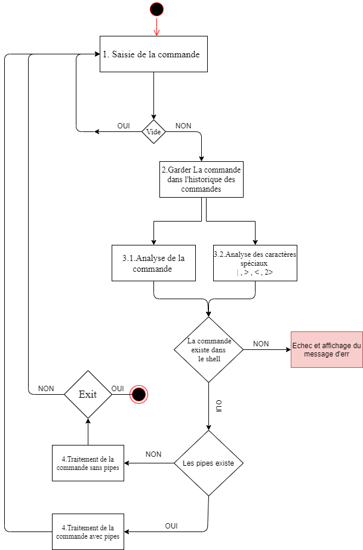

# Introduction 
### Sujet : un `Shell` pour les`tarballs` (*.tar) 
Le but du projet est de faire tourner un <ins>`Shell`</ins> qui permet à l'utilisateur de traiter les <ins>`tarballs`</ins> comme s'il s'agissait de répertoires, **sans que les tarballs ne soient désarchivés**.
Mais ca consiste en quoi un Shell ? et les tarballs ?

<ins>**Définitions :**</ins>
<ins>**Shell :**</ins> Le Shell (ou interface système en français) est un programme qui reçoit des commandes informatiques données par un utilisateur à partir de son clavier pour les envoyer au système d’exploitation qui se chargera de les exécuter.  

<ins>**Tarballs :**</ins> Le programme tar (de l'anglais tape archiver, littéralement « archiveur pour bande ») est un logiciel d'archivage de fichiers standard des systèmes de type UNIX. Il a été créé dans les premières versions d'UNIX et standardisé par les normes POSIX.1-1988 puis POSIX.1-2001. Il existe plusieurs implémentations1 tar, la plus couramment utilisée étant GNU tar. (Wikipédia)

### Préambule : 
Pour aboutir à une architecture logicielle rigoureuse on va devoir définir profondément les caractéristiques de ces deux instances (Shell et Tarballs) . Ceci dit connaitre les caractéristiques de chacun des deux nous mène à une application robuste qui fonctionne dans les normes.

<ins>**Caractéristiques d'un Shell :**</ins>
Les interpréteurs de commandes ont les caractéristiques suivantes :
- Permettre à l'utilisateur de saisir des commandes .
-  Ils possèdent des commandes `internes` et `externes`
	- **Commandes internes :**   sont des commandes dont le code est implanté au sein de l’interpréteur de commande . Exemples de commandes internes : **cd** , **echo** , **for** , **pwd** .
	
	- **Commandes externes :** Une _commande externe_ est une commande dont le code se trouve dans un fichier ordinaire. Le Shell crée un processus pour exécuter une commande externe. Parmi l’ensemble des commandes externes que l’on peut trouver dans un système, nous utiliserons principalement les _commandes Unix_ (ex : **ls**, **mkdir**, **vi**, **sleep**) et les _fichiers Shell_.
- Programmation Shell  , un langage de programmation qui inclut des fonctionnalités telles que des boucles, des instructions de condition et des variables.
- Manipulation des signaux , Mécanismes pour manipuler  les interruptions et autres signaux envoyés par le système d'exploitation.
- Historique de commandes , Une fonctionnalité qui stocke les commandes et vous permet de les modifier et de les réutiliser.

<ins>**Caractéristiques d'un Tarball :**</ins>
- Permettre à l'utilisateur de créer des archives.
- Permettre à l'utilisateur de voir le contenu des archives.
- Permettre à l'utilisateur d'extraire des fichiers.

par défaut, une archive tar n'est pas compressée, mais il suffit d'utiliser dessus un outil de compression tel que `gzip` pour obtenir des archives compressées `*.tar.gz` , souvent aussi nommées `*.tgz`

**Le format des archives Tar :**
Un fichier `tar` est une suite de blocs de 512 octets. S'il représente une archive des fichiers `f1`, … , `fn`, alors ce fichier `tar` comporte, dans l'ordre :

-   un bloc entête pour `f1`
-   les blocs correspondant au contenu de `f1`
-   …
-   un bloc entête pour `fn`
-   les blocs correspondant au contenu de `fn`
-   deux blocs finaux formés uniquement de zéros

Si la taille d'un des fichiers archivés `fi` n'est pas un multiple de 512, alors le dernier bloc concernant `fi` est complété avec des octets nuls `'\0'` à hauteur de 512 octets.
Un bloc entête a une structure décrite par le type `struct posix_header` dans le fichier [tar.h](../tar.h)  .cette structure fait exactement 512 octets de long. (TP1 SY5 2020)
```c
struct posix_header
{                              /* byte offset */
 char name[100];               /*   0 */
 char mode[8];                 /* 100 */
 char uid[8];                  /* 108 */
 char gid[8];                  /* 116 */
 char size[12];                /* 124 */
 char mtime[12];               /* 136 */
 char chksum[8];               /* 148 */
 char typeflag;                /* 156 */
 char linkname[100];           /* 157 */
 char magic[6];                /* 257 */
 char version[2];              /* 263 */
 char uname[32];               /* 265 */
 char gname[32];               /* 297 */
 char devmajor[8];             /* 329 */
 char devminor[8];             /* 337 */
 char prefix[155];             /* 345 */
 char junk[12];                /* 500 */
};
```

# Architecture générale du Shell
## Expression de besoins , cas d'utilisations et analyse 
### Durée de vie d'un shell 
Un Shell fait trois choses principales au cours de sa vie :
1. **Initialisation :** dans cette étape, un Shell typique lit et exécute ses fichiers de configuration. Celles-ci modifient certains aspects du comportement du Shell.
2. **Interprétation :** Ensuite, le Shell lit les commandes de `stdin` (qui pourrait être interactif, ou un fichier) et les exécute.
3. **Terminaison :** Une fois ses commandes exécutées, le Shell exécute toutes les commandes d'arrêt, libère de la mémoire et s'arrête.
### Le processus de fonctionnement de note Shell `zfi`
#### Une fois la commande entrée, les opérations suivantes sont effectuées:

1. La commende est entrée , si cette commande n'est pas la chaine vide on la garde dans l'historique des commandes .
2. Analyse : consiste en la division des commandes en sous chaines pour les interpréter .
3. Analyse pour les caractères spéciaux comme : **|** **<** **>** **2>** .
4. Vérification de l'existence de la commande dans le Shell i.e. une commende interprétable .
5. S'il existe des pipe , on les manipulera .
6. Exécution des  commandes en utilisant les processus avec la famille des **exec** **( execl , execv ...)** et **fork** .
7. Attendre la prochaine entrée .
## Diagramme du processus de fonctionnement 


## Outils techniques  pour l'implémentation 
+ La manipulation des fichiers se fera à l'aide des appels systèmes `open`, `close`, `read`, `write` 
+ La manipulation des répertoire se fera avec `opendir`, `readdir`, `closedir`  et `getcwd`, `chdir`, `mkdir` 
+ L'analyse peut être effectuée à l'aide de `strsep ("")`
+ Après l'analyse, on vérifie la liste des commandes intégrées et, le cas échéant, on l'exécute 
+ La détection des pipes peut également être effectuée à l'aide de `strsep («|»)` par exemple . Pour les gérer, on sépare d'abord la première partie de la commande de la seconde. Ensuite, après avoir analysé chaque partie, on appel les deux parties dans deux nouveaux enfants séparés, en utilisant la famille des `exec`.
+ pour plus de détails … (voir le code source)

## Expression de besoins 
### Spécifications fonctionnels 
- Le système (Shell) doit permettre à l'utilisateur de manipuler les tarballs sans même les désarchiver.
- Le système doit permettre à l'utilisateur d'utiliser les commandes `cd` et `exit` avec leur comportement habituel 
- Le système doit permettre à l'utilisateur d'utiliser toutes les commandes externes et elles  doivent fonctionner normalement si leur déroulement n'implique pas l'utilisation d'un fichier (au sens large) dans un tarball.
- Le système doit permettre à l'utilisateur d'utiliser la commande `pwd` et celle-ci doit fonctionner y compris si le répertoire courant passe dans un tarball.
- Le système doit permettre à l'utilisateur d'utiliser `mkdir`, `rmdir` et `mv` et doivent fonctionner y compris avec des chemins impliquant des tarball quand ils sont utilisés sans option.
- Le système doit permettre à l'utilisateur d'utiliser `cp` et `rm` et doivent fonctionner y compris avec des chemins impliquant des tarball quand ils sont utilisés sans option ou avec l'option `-r`
- Le système doit permettre à l'utilisateur d'utiliser   `ls` et elle doit fonctionner y compris avec des chemins impliquant des tarball quand il est utilisé sans option ou avec l'option `-l`
- Le système doit permettre à l'utilisateur d'utiliser `cat` et elle doit fonctionner y compris avec des chemins impliquant des tarball quand il est utilisé sans option
- Le système doit permettre à l'utilisateur d'utiliser les redirections de l'entrée, de la sortie et de la sortie erreur
- Le système doit permettre à l'utilisateur d'introduire des commandes complexes (utilisation des pipes "|")

| Id | Spécification | État | Criticisme | Effort | Stabilité |
| -- | --------------   | ----  | -----------  | ------- | ---------  | ---- |
| 1  | Le système (Shell) doit permettre à l'utilisateur de manipuler les tarballs sans même les désarchiver | Proposé | Critique | Stable |
| 2  | Le système doit permettre à l'utilisateur d'utiliser les commandes `cd` et `exit` avec leur comportement habituel | Proposé | Critique | Stable |
| 3  |Le système doit permettre à l'utilisateur d'utiliser toutes les commandes externes et elles  doivent fonctionner normalement si leur déroulement n'implique pas l'utilisation d'un fichier (au sens large) dans un tarball | Proposé | Critique | Stable |
| 4  | Le système doit permettre à l'utilisateur d'utiliser la commande `pwd` et celle-ci doit fonctionner y compris si le répertoire courant passe dans un tarball | Proposé | Critique | Stable |
| 5  | Le système doit permettre à l'utilisateur d'utiliser `mkdir`, `rmdir` et `mv` et doivent fonctionner y compris avec des chemins impliquant des tarball quand ils sont utilisés sans option  | Proposé | Critique | Stable |
| 6  | Le système doit permettre à l'utilisateur d'utiliser `cp` et `rm` et doivent fonctionner y compris avec des chemins impliquant des tarball quand ils sont utilisés sans option ou avec l'option `-r` | Proposé | Critique | Stable |
| 7  | Le système doit permettre à l'utilisateur d'utiliser   `ls` et elle doit fonctionner y compris avec des chemins impliquant des tarball quand il est utilisé sans option ou avec l'option `-l` | Proposé | Critique | Stable |
| 8  | Le système doit permettre à l'utilisateur d'utiliser `cat` et elle doit fonctionner y compris avec des chemins impliquant des tarball quand il est utilisé sans option| Proposé | Critique | Stable |
| 9  | Le système doit permettre à l'utilisateur d'utiliser les redirections de l'entrée, de la sortie et de la sortie erreur | Proposé | Critique | Stable |
| 10 | Le système doit permettre à l'utilisateur d'introduire des commandes complexes (utilisation des pipes "\|") | Proposé |  Critique | Stable |

**État** <br/>
`Proposé : en cours de discussion, pas encore validé`<br/>
`Approuvé : validé et attend d’être implémenté`<br/>
`Rejeté : rejeté et n’attendra pas son implémentation`<br/>
`Incorporé : spécification qui a été implémentée durant une version antrieure`<br/>
**Criticisme**<br/>
` Critique : la spécification doit être implémentée sinon le système n’est pas accepté`<br/>
`Important : la spécification peut être omise mais son omission affecterait considérablement l’utilisabilité du système`<br/>
` Utile : la spécification peut être omise et son omission n’a pas un grand impact sur le système`<br/>
**Effort**<br/>
`Estimation approximative des ressources et du temps nécessaire pour la spécification`<br/>
**Stabilité**<br/>
`La probabilité que la spécification change dans le temps`<br/>
 Ces attributs évoluent au fil du temps ( avancement du projet )


### Spéciations techniques 
- Le système doit être programmer en langage C
- Le système doit lancer tous les processus en premier plan
- Le système doit être testé sur la distribution linux antiX-19 (v19.2.1) ou bien sur un conteneur Docker 
- le système doit être programmer en utilisant seulement les bibliothèques et les fonctions de bas niveau